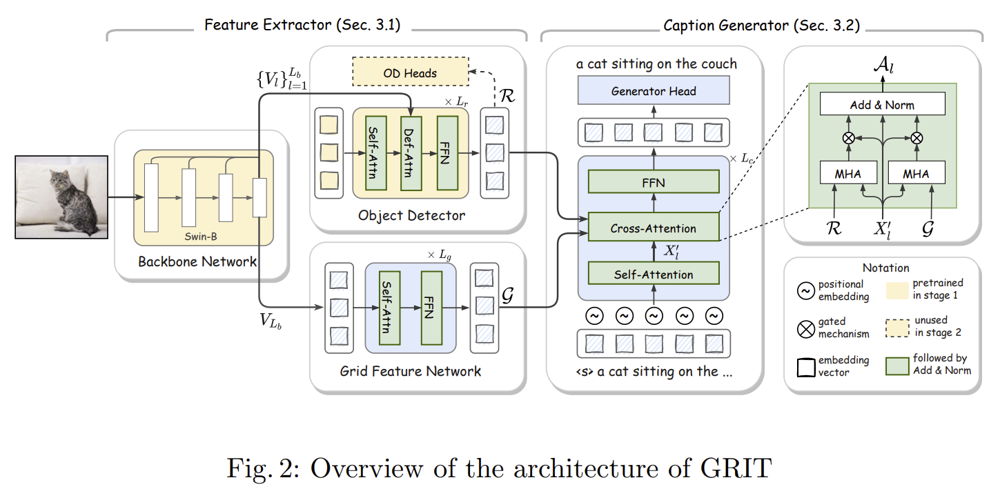

## GRIT: Faster and Better Image-captioning Transformer (ECCV 2022)

This is the code implementation for the paper titled: "GRIT: Faster and Better Image-captioning Transformer Using Dual Visual Features" (Accepted to ECCV 2022) [[Arxiv](https://arxiv.org/abs/2207.09666)].


## Introduction

This paper proposes a Transformer neural architecture, dubbed <b>GRIT</b> (Grid- and Region-based Image captioning Transformer), that effectively utilizes the two visual features to generate better captions. GRIT replaces the CNN-based detector employed in previous methods with a DETR-based one, making it computationally faster.


<div align=center>  

</div>


## Model Zoo

> **It will be reformatted into a table**. The checkpoints are currently stored temporarily on Google Drive with limited space. More checkpoints will be updated with better location.
- pretrained object detector on Visual Genome: [checkpoint](https://drive.google.com/file/d/1dlzNkbs81ZSdeGCxKrRhLGKK_TBTdXjL/view?usp=sharing).
- pretrained object detector on 4 datasets: [checkpoint](https://drive.google.com/file/d/1J2_Q3n4BHQgh0JhImd7c39wx5hEFzjzB/view?usp=sharing).
- checkpoint for GRIT on image caption (using the detector pretrained on VG): [checkpoint](https://drive.google.com/file/d/1ViqBJ_i9CVABpy48pOAC1MDHZ6e5Zj1v/view?usp=sharing).
- checkpoint for GRIT on image caption (using the detector pretrained on 4DS): [checkpoint](https://drive.google.com/file/d/1WLsMrtVFTftSJiGHg7iALNFImtefHtOT/view?usp=sharing). 

## Installation

### Requirements
* Python >= 3.9, CUDA >= 11.3
* PyTorch >= 1.12.0, torchvision >= 0.6.1
* Other packages: pycocotools, tensorboard, tqdm, h5py, nltk, einops, hydra, spacy, and timm

* First, clone the repository locally:
```shell
git clone https://github.com/davidnvq/grit.git
cd grit
```
* Then, create an environment and install PyTorch and torchvision:
```shell
conda create -n grit python=3.9
conda activate grit
pip install torch torchvision --extra-index-url https://download.pytorch.org/whl/cu113
# ^ if the CUDA version is not compatible with your system; visit pytorch.org for compatible matches.
```
* Install other requirements:
```shell
pip install -r requirements.txt
python -m spacy download en
```
* Install Deformable Attention:
```shell
cd models/ops/
python setup.py build develop
python test.py
```

## Usage

> Currently, the README and source code are under its initial version. The cleaned and detailed version may be updated soon.

### Data preparation

Download and extract COCO 2017 train and val images with annotations from
[http://cocodataset.org](http://cocodataset.org/#download).
We expect the directory structure to be the following:
```
path/to/coco_caption/
├── annotations/  # annotation json files and Karapthy files
├── train2014/    # train images
├── val2014/      # val images
└── test2014/     # test images
```
* Copy the files in `data/` to the above `annotations` folder. It includes `vocab.json` and some files containing Karapthy ids.

### Training

The model is trained with default settings in the configurations file in `configs/caption/coco_config.yaml`:
The training process takes around 16 hours on a machine with 8 A100 GPU.
We also provide the code for extracting pretrained features (freezed object detector), which will speed up the training significantly.

* With default configurations (e.g., 'parallel Attention', pretrained detectors on VG or 4DS, etc):
```shell
export DATA_ROOT=path/to/coco_dataset
# with pretrained object detector on 4 datasets
python train_caption.py exp.name=caption_4ds model.detector.checkpoint=4ds_detector_path

# with pretrained object detector on Visual Genome
python train_caption.py exp.name=caption_4ds model.detector.checkpoint=vg_detector_path
```
* **More configurations will be added here for obtaining ablation results**.

### Evaluation

The evaluation will be run on a single GPU.
* Evaluation on **Karapthy splits**:
```shell
export DATA_ROOT=path/to/coco_caption
# evaluate on the validation split
python eval_caption.py +split='valid' exp.checkpoint=path_to_caption_checkpoint

# evaluate on the test split
python eval_caption.py +split='test' exp.checkpoint=path_to_caption_checkpoint
```
* Evaluation on the **online splits**:
```shell
export DATA_ROOT=path/to/coco_caption
# evaluate on the validation split
python eval_caption_online.py +split='valid' exp.checkpoint=path_to_caption_checkpoint

# evaluate on the test split
python eval_caption_online.py +split='test' exp.checkpoint=path_to_caption_checkpoint
```


## Citation
If you find this code useful, please kindly cite the paper with the following bibtex:
```bibtex
@article{nguyen2022grit,
  title={GRIT: Faster and Better Image captioning Transformer Using Dual Visual Features},
  author={Nguyen, Van-Quang and Suganuma, Masanori and Okatani, Takayuki},
  journal={arXiv preprint arXiv:2207.09666},
  year={2022}
}
```

## Acknowledgement
We have inherited several open source projects into ours: i) implmentation of [Swin Transformer](https://github.com/microsoft/Swin-Transformer), ii) implementation of [Deformable DETR](https://github.com/fundamentalvision/Deformable-DETR), and iii) implementation of image captioning base from [M2-Transformer](https://github.com/aimagelab/meshed-memory-transformer). We thank the authors of these open source projects.